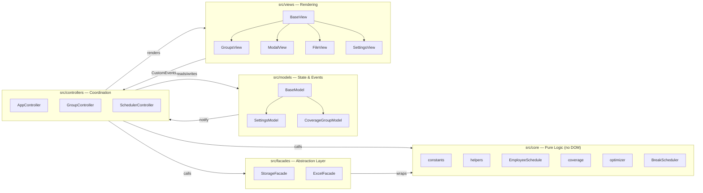
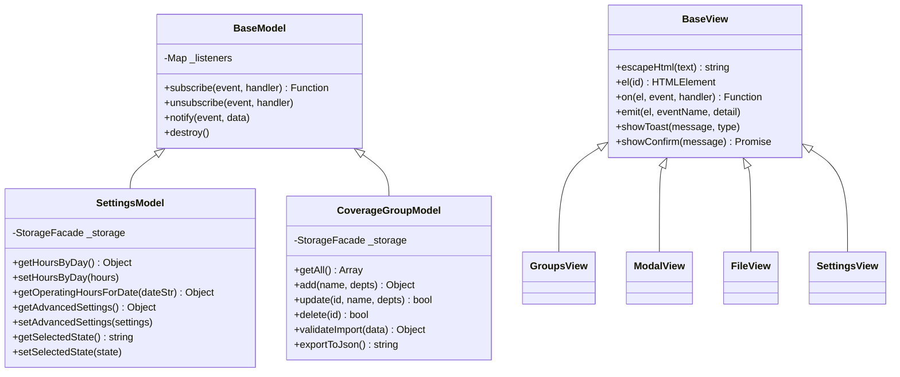
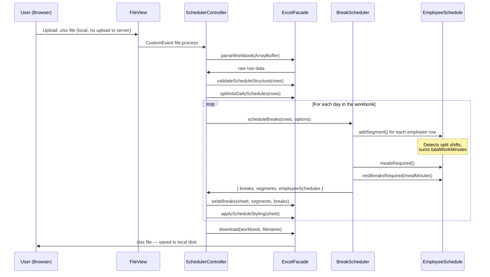
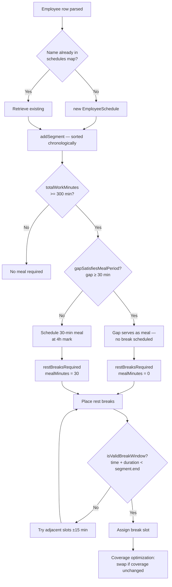
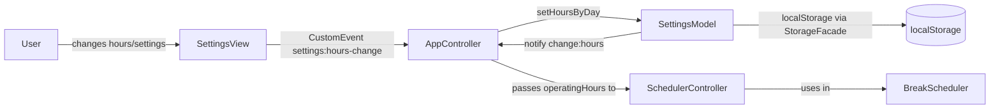
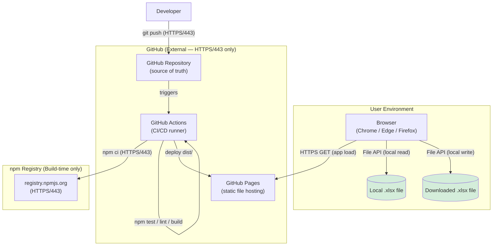

# Break Schedule Tool

A client-side web application that automatically generates legally-compliant California employee break schedules from UKG schedule exports. Rebuilt from a 2,500-line monolith into a professional MVC architecture with 94 passing unit tests, a Vite build pipeline, and GitHub Pages CI/CD.

> **Portfolio note:** This project started as a personal productivity tool built while working in retail. The refactor documented here demonstrates enterprise software engineering patterns — MVC, Facade, Inheritance, Observer — rigorous testing, security hardening, and CI/CD, in support of a career transition to software engineering.

**Live Demo:** [GitHub Pages](https://YOUR_USERNAME.github.io/break-schedule-tool)

---

## The Problem

Managers at large retail stores manually copy break times from a printed UKG schedule into a separate spreadsheet — a process that takes 20–45 minutes per day and is prone to California labor law errors (incorrect meal periods, missed rest breaks, breaks scheduled during split shift gaps).

This tool accepts a UKG-exported `.xlsx` file, parses all employee shifts including split shifts, applies California meal period and rest break rules, optimizes break times by coverage group, then writes the results back into the original spreadsheet format for download.

---

## a. Architecture and Design

### Design Patterns

| Pattern | Where Applied | Purpose |
|---|---|---|
| **MVC** | `models/` ↔ `controllers/` ↔ `views/` | Separates business logic from UI; core scheduling is testable without a DOM |
| **Facade** | `StorageFacade`, `ExcelFacade` | Hides `localStorage` JSON quirks and `xlsx.js` sheet manipulation behind clean interfaces |
| **Inheritance** | `BaseModel → SettingsModel / CoverageGroupModel` | Shared Observer behavior without duplication |
| **Inheritance** | `BaseView → GroupsView / ModalView / FileView / SettingsView` | Shared DOM helpers (`escapeHtml`, `on`, `emit`, `showToast`) without duplication |
| **Observer** | `BaseModel.subscribe / notify` | Controllers subscribe to model events; views re-render on `change:hours`, `change:groups`, etc. without direct coupling |

### MVC Layer Diagram



### Class Inheritance Diagram



### Project Structure

```
src/
├── core/                      # Pure logic — no DOM, fully unit-testable
│   ├── constants.js           # Department registry, default groups, CA law thresholds
│   ├── helpers.js             # timeToMinutes, minutesToTime, formatName, findGroupContaining
│   ├── EmployeeSchedule.js    # Per-employee segments; split shift aware
│   ├── coverage.js            # calculateCoverageMap, getCoworkersAtTime
│   ├── optimizer.js           # findOptimalBreakTime — scores candidates by coverage impact
│   └── BreakScheduler.js      # Main scheduling algorithm
├── facades/
│   ├── StorageFacade.js       # localStorage: namespaced keys, safe JSON parse/serialize
│   └── ExcelFacade.js         # xlsx.js: parse, validate, style, write breaks, download
├── models/
│   ├── BaseModel.js           # Observer/EventEmitter base class
│   ├── SettingsModel.js       # Operating hours, advanced settings, state selection
│   └── CoverageGroupModel.js  # Group CRUD, import/export, validation
├── views/
│   ├── BaseView.js            # Shared DOM helpers
│   ├── GroupsView.js          # Groups list rendering
│   ├── ModalView.js           # Add/edit group modal
│   ├── FileView.js            # File upload and download UI
│   └── SettingsView.js        # Operating hours and advanced settings UI
├── controllers/
│   ├── AppController.js       # Composition root — wires all components at startup
│   ├── GroupController.js     # Coordinates CoverageGroupModel ↔ GroupsView ↔ ModalView
│   └── SchedulerController.js # Orchestrates file → parse → schedule → download pipeline
└── main.js                    # Entry point

tests/
├── core/
│   ├── helpers.test.js
│   ├── EmployeeSchedule.test.js   # Split shift edge cases, CA law thresholds
│   └── BreakScheduler.test.js     # CA law compliance, break placement validity
├── models/
│   └── SettingsModel.test.js      # Observer pattern, operating hours date resolution
└── fixtures/
    └── scheduleData.js            # Synthetic test data — no real employee names or PII
```

---

## b. Data Flow Diagrams

### File Processing Pipeline



### Split Shift Break Decision Flow



### Settings and State Data Flow



---

## c. Network Diagram

This application is **entirely client-side**. All file processing occurs in the user's browser. No employee data is transmitted to any server.



**Runtime connections:** The browser loads the app from GitHub Pages once over HTTPS. After that, all operations are local — the Content Security Policy (`connect-src 'none'`) enforces this at the browser level.

**Build-time connections:** GitHub Actions pulls npm packages from the npm registry during CI. No packages are fetched at runtime.

**CDE scope:** This application handles employee shift schedules only. It does not process, transmit, store, or display payment card data and is therefore **out of scope for PCI DSS / CDE requirements**.

---

## d. Secure Configuration, Installation, and Operation

### Prerequisites

- Node.js v20 LTS or later
- npm v9+ (included with Node.js)
- A modern browser (Chrome, Edge, or Firefox — required for the File System Access API)

### Installation

```bash
git clone https://github.com/YOUR_USERNAME/break-schedule-tool.git
cd break-schedule-tool
npm install
```

All dependencies are pinned in `package-lock.json`. Use `npm ci` (not `npm install`) in automated environments to enforce exact versions.

### Development

```bash
npm run dev       # Vite dev server at http://localhost:5173
npm test          # Run all 94 unit tests
npm run test:watch  # Watch mode for TDD
npm run lint      # ESLint with eslint-plugin-security
npm run build     # Production build → dist/
```

### Production Deployment

The CI/CD pipeline in [.github/workflows/static.yml](.github/workflows/static.yml) enforces the following gate before any deployment:

```
npm ci → npm test → npm run lint → npm run build → deploy dist/
```

A failed test, lint error, or build error blocks deployment automatically. Only the compiled `dist/` directory is deployed — no source files, test files, or `node_modules` reach the hosting environment.

### Operational Security Notes

- The app must be served over **HTTPS**. GitHub Pages enforces this by default.
- The CSP meta tag is set at build time and cannot be overridden without a source code change and a new CI/CD run.
- `localStorage` stores user settings (operating hours, coverage groups) only — no employee names, shift data, or PII are persisted.
- Uploaded schedule files are processed entirely in memory and are never written to `localStorage` or sent anywhere.

---

## e. Functions, Ports, Protocols, and Services

### Runtime (Browser)

| Item | Value | Notes |
|---|---|---|
| Protocol | HTTPS | TLS 1.2+ enforced by GitHub Pages |
| Port | 443 | Standard HTTPS — no custom ports |
| Outbound connections | None | CSP `connect-src 'none'` blocks all runtime fetch/XHR |
| File I/O | Browser File API | Local read only — no server upload |
| Persistent storage | `localStorage` | Settings only; namespaced under `breakSchedule:` prefix |
| Cookies | None | No cookies set or read |
| Service workers | None | No offline caching layer |
| WebSockets | None | Not used |
| Third-party scripts | None | All assets bundled via npm; no CDN calls at runtime |

### Build-time (CI/CD)

| Item | Value | Notes |
|---|---|---|
| Protocol | HTTPS | GitHub Actions → npm registry, GitHub Pages |
| Port | 443 | Standard HTTPS |
| npm registry | registry.npmjs.org | `npm ci` only — locked to `package-lock.json` |
| GitHub Actions runner | ubuntu-latest | Ephemeral, GitHub-managed |

### Development Server

| Item | Value | Notes |
|---|---|---|
| Protocol | HTTP | Local only — `localhost:5173` |
| Port | 5173 | Vite default — not exposed externally |

### Insecure / Disabled Functions

| Item | Status | Reason |
|---|---|---|
| `eval()` / `new Function()` | Not used | Flagged by `eslint-plugin-security` |
| `innerHTML` with unsanitized input | Not used | All dynamic content passes through `BaseView.escapeHtml()` |
| CDN script loading | Disabled by CSP | `script-src 'self'` blocks external script sources |
| Inline `<script>` tags | Disabled by CSP | `script-src 'self'` (no `'unsafe-inline'`) |
| HTTP (non-TLS) | Not applicable | GitHub Pages redirects all HTTP to HTTPS |

---

## f. Administrative and Privileged Functions

This application has no user accounts, authentication, or server-side components. "Administrative" functions are configuration tasks available to anyone with access to the running app.

| Function | Access | Description |
|---|---|---|
| **Coverage group management** | Any user | Add, edit, delete, import, export, or reset department coverage groups |
| **Operating hours configuration** | Any user | Set per-day store open/close times used to constrain break placement |
| **Advanced scheduling settings** | Any user | Tune `maxEarly`, `maxDelay`, `deptWeightMultiplier`, `proximityWeight` |
| **State selection** | Any user | Switch labor law jurisdiction (currently California only) |
| **Source code changes** | Repository contributors | Changes require a passing CI/CD pipeline before deployment |
| **Deployment** | GitHub Actions (automated) | Triggered on push to `main`; requires all tests and lint to pass |
| **Repository settings** | Repository owner | Branch protection, secrets, Actions permissions — managed in GitHub |

**Recommendation for enterprise deployment:** If adopted organization-wide, coverage group defaults and operating hours should be pre-configured by a designated administrator and distributed via the JSON import/export feature. Store-level users should be instructed not to modify advanced settings without guidance.

---

## g. Security and Privacy Functions

### Content Security Policy

The following CSP is applied via `<meta http-equiv="Content-Security-Policy">` at build time:

```
default-src 'self';
style-src 'self' 'unsafe-inline';
font-src 'self' data:;
img-src 'self' data:;
script-src 'self';
connect-src 'none';
```

`connect-src 'none'` is the most significant directive — it prevents the page from making any network requests after the initial load, regardless of what JavaScript runs.

`'unsafe-inline'` for styles is required by Bootstrap 4's component animations. Script execution is restricted to `'self'` only.

### Input Validation

`ExcelFacade.validateScheduleStructure()` checks for required column headers before any data is processed. Malformed or unexpected files are rejected with a user-facing error before the scheduling pipeline runs.

### XSS Prevention

All dynamic content derived from file input passes through `BaseView.escapeHtml()` before being written to the DOM via `textContent` or `innerHTML`. The core scheduling pipeline never touches the DOM.

### Dependency Security

- All runtime dependencies are bundled at build time via Vite — no packages are fetched at runtime.
- `package-lock.json` locks all transitive dependency versions.
- `npm audit` should be run periodically to check for known vulnerabilities. Run `npm audit fix` for automatically resolvable issues; review manually for breaking changes.
- `eslint-plugin-security` runs on every CI build and flags patterns such as `eval()`, unsafe regex, and unvalidated dynamic access.

### Privacy

- No employee names, shift data, or personally identifiable information are stored in `localStorage` or transmitted anywhere.
- Schedule files exist only in browser memory during processing and are discarded when the page is closed or a new file is uploaded.
- The fixture data used in unit tests (`tests/fixtures/scheduleData.js`) uses entirely synthetic names — no real employee data.

### Maintenance

| Task | Frequency | Method |
|---|---|---|
| `npm audit` | Monthly or after any `npm install` | `npm audit` / `npm audit fix` |
| Dependency updates | Quarterly | Review `npm outdated`, test, update `package-lock.json` |
| ESLint rule review | With major ESLint or plugin releases | Review `eslint.config.js` against updated rule sets |
| CSP review | When adding new features | Verify no new external origins or inline scripts are required |

---

## h. Roles and Responsibilities

| Role | Current Assignment | Responsibilities |
|---|---|---|
| **Developer / Owner** | Kaden Campbell | Feature development, bug fixes, dependency updates, CI/CD configuration |
| **Security reviewer** | Unassigned | Periodic `npm audit` review, CSP review, code review for security-sensitive changes |
| **IT / Cybersecurity partner** | Unassigned — pending organizational adoption | Review for compliance with enterprise Secure Software Development Standard; approve for internal distribution |

**Note:** This tool is currently maintained by a single developer outside corporate IT infrastructure. Enterprise adoption would require designating an IT/cybersecurity contact, establishing a formal vulnerability disclosure process, and onboarding the repository to corporate version control per REI's Secure Software Development Standard.

---

## i. Significant Changes and Remediation

### v2.0 — Professional Refactor (current)

Complete architectural rebuild addressing structural issues and confirmed logic bugs in v1.x.

#### Structural Changes

| Change | v1.x | v2.0 |
|---|---|---|
| Architecture | 2,500 lines across 2 files, no separation of concerns | MVC: `models/`, `views/`, `controllers/`, `core/` |
| Dependencies | CDN-loaded Bootstrap, Font Awesome, xlsx | npm packages, bundled by Vite — no runtime CDN calls |
| Build pipeline | None — raw files served directly | Vite: tree-shaking, chunking, source maps, `dist/` only deployed |
| Testing | None | 94 Vitest unit tests |
| Static analysis | None | ESLint + `eslint-plugin-security` |
| CI/CD | Deploy on push (no gates) | Test → lint → build → deploy (failing gate blocks deployment) |
| Security | No CSP, CDN scripts, global namespace | CSP meta tag, `connect-src 'none'`, ES modules |

#### Bug Remediation

**Bug 1 — Split shift duration miscalculation (labor law compliance, critical)**

*Symptom:* An employee working two separate segments (e.g., 7AM–11AM and 3PM–7PM, totalling 8 hours) was treated as working a 12-hour span from first clock-in to last clock-out. This caused the scheduler to assign an extra meal period and extra rest breaks in violation of California law.

*Root cause:* `shifts[name] = [Math.min(...starts), Math.max(...ends)]` — span instead of sum.

*Fix:* `EmployeeSchedule.totalWorkMinutes` sums actual segment durations:
```js
get totalWorkMinutes() {
    return this.segments.reduce((sum, s) => sum + (s.end - s.start), 0);
}
```

---

**Bug 2 — Break slot index collision (data integrity)**

*Symptom:* For employees requiring both a second rest break and a second meal period, one silently overwrote the other in the output spreadsheet.

*Root cause:* Breaks were stored as a positional array — `breaks[name][2]` was used for both the second rest break and the second meal period.

*Fix:* Named break structure:
```js
breaks[name] = { rest1: null, meal: null, rest2: null, rest3: null };
```

---

**Bug 3 — Break placed inside unpaid gap (labor law compliance)**

*Symptom:* Rest breaks were occasionally scheduled during the unpaid gap between a split shift's two segments, placing the employee "on break" during time they were not clocked in.

*Root cause:* Validity check used `shiftStart` and `shiftEnd` from the overall span rather than individual segment boundaries.

*Fix:* `isValidBreakWindow(time, duration)` requires the entire break to fall strictly within one segment:
```js
isValidBreakWindow(time, duration) {
    return this.segments.some(s => time >= s.start && (time + duration) < s.end);
}
```

---

**Bug 4 — DOM-coupled scheduling logic (testability / reliability)**

*Symptom:* `getOperatingHoursForDate()` read directly from `<input>` DOM elements. This made it impossible to unit test and caused silent failures if called before the DOM was fully rendered.

*Fix:* Logic moved to `SettingsModel.getOperatingHoursForDate(dateString)`, which reads from in-memory model state populated by `StorageFacade`. No DOM access in the scheduling pipeline.

---

**Bug 5 — Duplicate function with incompatible signatures (reliability)**

*Symptom:* `findGroupContaining` existed in two places with different parameter signatures. Callers in different parts of the codebase used whichever version was in scope, producing inconsistent results.

*Fix:* Single canonical implementation in `src/core/helpers.js` with an explicit `groups` parameter required at all call sites.

---

## California Labor Law Reference

| Hours Worked | Meal Periods Required | Rest Breaks Required |
|---|---|---|
| < 3.5h (< 210 min) | 0 | 0 |
| ≥ 3.5h, < 5h | 0 | 1 |
| ≥ 5h (≥ 300 min) | 1 | 2 |
| ≥ 10h (≥ 600 min) | 2 | 3 |
| Split shift — gap ≥ 30 min | Gap satisfies first meal | Based on `totalWorkMinutes` sum |

Thresholds use strict California IWC Wage Order values: exactly 5 hours triggers the first meal period; exactly 10 hours triggers the second.

---

## Tech Stack

| Tool | Version | Purpose |
|---|---|---|
| **Vite** | ^5.0 | Build tool, dev server, ESM bundling |
| **Vitest** | ^1.0 | Unit testing — ESM-native, shares Vite config |
| **ESLint** | ^9.0 | Static analysis |
| **eslint-plugin-security** | ^3.0 | Security-specific lint rules |
| **Bootstrap** | ^4.6.2 | UI components (npm — no CDN) |
| **Font Awesome** | ^6.5.0 | Icons (npm — no CDN) |
| **xlsx (SheetJS)** | ^0.18.5 | Excel file parsing and generation |
| **@rollup/plugin-inject** | ^5.0 | Provides jQuery global for Bootstrap 4 in ESM context |
| **GitHub Actions** | — | CI/CD: test → lint → build → deploy |
| **GitHub Pages** | — | Static hosting over HTTPS |

---

## License

MIT
