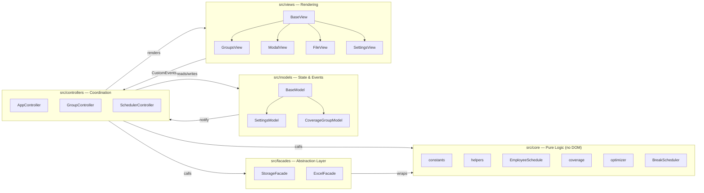
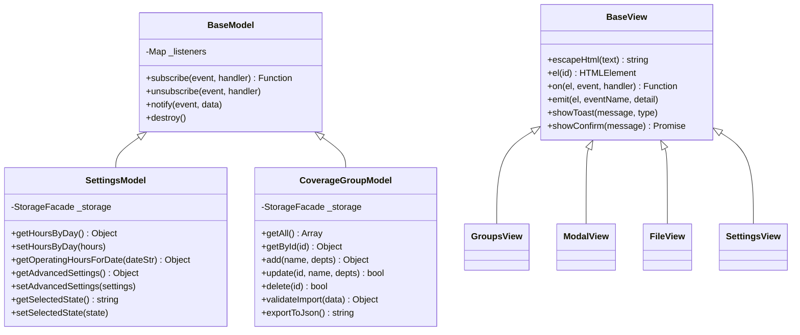
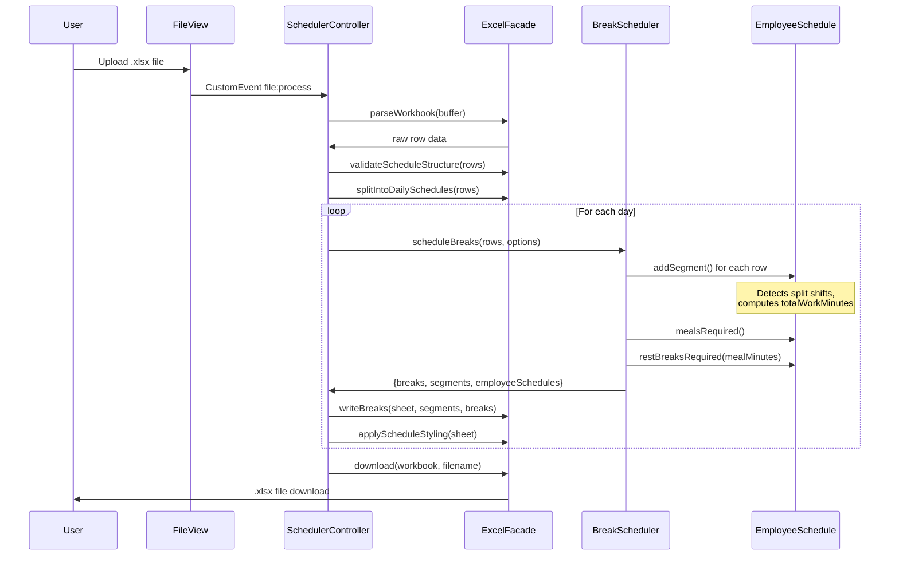
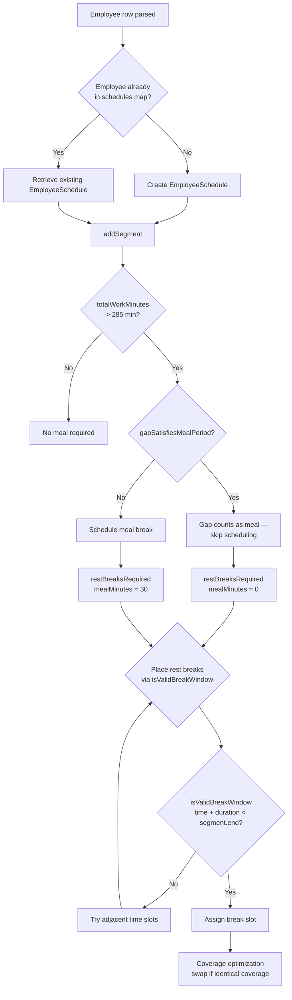

# Break Schedule Tool

A client-side web application that automatically generates legally-compliant California employee break schedules from UKG schedule exports. Rebuilt from a working-but-tangled 2,500-line codebase into a professional MVC architecture with 94 passing unit tests, a Vite build pipeline, and GitHub Pages CI/CD.

> **Portfolio note:** This project started as a personal productivity tool I built while working in retail. The refactor documented here was undertaken to demonstrate enterprise software engineering patterns — MVC, Facade, Inheritance, Observer — as well as rigorous testing, security hardening, and CI/CD, in support of a career transition to software engineering.

---

## Live Demo

[View on GitHub Pages](https://YOUR_USERNAME.github.io/break-schedule-tool)

---

## The Problem

Managers at large retail stores manually copy break times from a printed UKG schedule into a separate spreadsheet — a process that takes 20–45 minutes per day and is prone to California labor law errors (incorrect meal periods, missed rest breaks, breaks scheduled during split shift gaps).

This tool:
1. Accepts the UKG-exported `.xlsx` file as input
2. Parses all employee shifts, including split shifts (one employee appearing in two rows)
3. Applies California meal period and rest break rules
4. Optimizes break times using a coverage model so coworkers in the same department aren't on break simultaneously
5. Writes the scheduled breaks back into the original spreadsheet format and offers it for download

---

## Architecture

### MVC Layer Diagram



### Class Inheritance Diagram



### File Processing Data Flow



### Split Shift Break Logic



---

## Design Patterns

| Pattern | Where Applied | Why |
|---|---|---|
| **MVC** | `models/` ↔ `controllers/` ↔ `views/` | Separates business logic from UI; core is testable without a DOM |
| **Facade** | `StorageFacade`, `ExcelFacade` | Hides `localStorage` JSON quirks and `xlsx.js` sheet manipulation behind clean interfaces |
| **Inheritance** | `BaseModel → SettingsModel / CoverageGroupModel` | Shared Observer behavior without duplication |
| **Inheritance** | `BaseView → GroupsView / ModalView / FileView / SettingsView` | Shared DOM helpers (`escapeHtml`, `on`, `emit`, `showToast`) without duplication |
| **Observer** | `BaseModel.subscribe / notify` | Controllers subscribe to model events; views re-render on `change:hours`, `change:groups`, etc. |

---

## Confirmed Bugs Fixed

These bugs existed silently in the original codebase. Identifying them required careful reading of California labor law and tracing the data structures.

### 1. Split Shift Duration Miscalculation *(critical)*

**Old behavior:** `shifts[name] = [Math.min(...starts), Math.max(...ends)]`

An employee working 7AM–11AM and 3PM–7PM (8 hours of actual work) was treated as working a 12-hour span. This triggered two meal periods and three rest breaks instead of the correct two rest breaks with the gap satisfying the meal.

**Fix:** `EmployeeSchedule.totalWorkMinutes` sums actual segment durations:
```js
get totalWorkMinutes() {
    return this.segments.reduce((sum, s) => sum + (s.end - s.start), 0);
}
```

### 2. Break Slot Index Collision

**Old behavior:** Breaks were stored positionally — `breaks[name][0]`, `[1]`, `[2]`. A second meal period and a second rest break both wrote to index 2 and silently overwrote each other.

**Fix:** Named break structure eliminates ambiguity:
```js
breaks[name] = { rest1: null, meal: null, rest2: null, rest3: null };
```

### 3. Break Placed Inside Unpaid Gap

**Old behavior:** `idealTime = shiftStart + N` could land in the unpaid gap between split shift segments. The old validity check `time >= start && time + duration <= end` used the overall span, not individual segments.

**Fix:** `isValidBreakWindow(time, duration)` requires the entire break to fit within a single segment, and uses strict `<` for the end boundary:
```js
isValidBreakWindow(time, duration) {
    const breakEnd = time + duration;
    return this.segments.some(s => time >= s.start && breakEnd < s.end);
}
```

### 4. DOM-Coupled Scheduling Logic

**Old behavior:** `getOperatingHoursForDate()` read directly from `<input>` elements, making it completely untestable.

**Fix:** `SettingsModel.getOperatingHoursForDate(dateString)` reads from in-memory model state. No DOM access in the scheduling pipeline.

### 5. Duplicate `findGroupContaining` with Different Signatures

The function existed twice with incompatible signatures. **Fix:** One canonical implementation in `src/core/helpers.js` with an explicit `groups` parameter.

---

## Tech Stack

| Tool | Purpose |
|---|---|
| **Vite** | Build tool, dev server, ESM bundling |
| **Vitest** | Unit testing (ESM-native, same config as Vite) |
| **ESLint** + `eslint-plugin-security` | Static analysis, security linting |
| **Bootstrap 4** | UI components (via npm, not CDN) |
| **Font Awesome** | Icons (via npm, not CDN) |
| **xlsx (SheetJS)** | Excel file parsing and generation |
| **@rollup/plugin-inject** | Provides jQuery global for Bootstrap 4's modal/collapse plugins in ESM context |
| **GitHub Actions** | CI/CD: test → lint → build → deploy to Pages |

---

## Getting Started

### Prerequisites

- Node.js v20+

### Install

```bash
npm install
```

### Development

```bash
npm run dev
# Open http://localhost:5173
```

### Test

```bash
npm test           # run all tests once
npm run test:watch # watch mode
```

### Lint

```bash
npm run lint
```

### Build

```bash
npm run build
# Output in dist/
```

---

## Project Structure

```
src/
├── core/                   # Pure logic — no DOM, fully testable
│   ├── constants.js        # Department registry, default groups, CA law thresholds
│   ├── helpers.js          # timeToMinutes, minutesToTime, formatName, findGroupContaining
│   ├── EmployeeSchedule.js # Models all segments for one employee; split shift aware
│   ├── coverage.js         # calculateCoverageMap, getCoworkersAtTime
│   ├── optimizer.js        # findOptimalBreakTime — scores candidates by coverage impact
│   └── BreakScheduler.js   # Main scheduling algorithm
├── facades/
│   ├── StorageFacade.js    # localStorage: safe JSON, namespaced keys
│   └── ExcelFacade.js      # xlsx.js: parse, validate, style, download
├── models/
│   ├── BaseModel.js        # Observer/EventEmitter base
│   ├── SettingsModel.js    # Operating hours, advanced settings, state selection
│   └── CoverageGroupModel.js # Group CRUD, import/export, validation
├── views/
│   ├── BaseView.js         # escapeHtml, el(), on(), emit(), showToast(), showConfirm()
│   ├── GroupsView.js       # Groups list rendering
│   ├── ModalView.js        # Add/edit group modal
│   ├── FileView.js         # File upload and download UI
│   └── SettingsView.js     # Operating hours and advanced settings UI
├── controllers/
│   ├── AppController.js    # Composition root — wires all components
│   ├── GroupController.js  # Coordinates groups model ↔ views
│   └── SchedulerController.js # Orchestrates file → schedule → download pipeline
└── main.js                 # Entry point

tests/
├── core/
│   ├── helpers.test.js
│   ├── EmployeeSchedule.test.js  # Split shift edge cases
│   └── BreakScheduler.test.js    # CA law compliance table
├── models/
│   └── SettingsModel.test.js     # Observer pattern, operating hours logic
└── fixtures/
    └── scheduleData.js           # Synthetic test data (no real employee names)
```

---

## Security

- **Content Security Policy** — `<meta http-equiv="Content-Security-Policy">` restricts all assets to `'self'`; no inline scripts, no external origins
- **No CDN dependencies** — Bootstrap, Font Awesome, and xlsx are bundled via npm; no third-party scripts loaded at runtime
- **Input validation** — `ExcelFacade.validateScheduleStructure()` checks required columns before processing
- **XSS prevention** — All user-facing strings pass through `BaseView.escapeHtml()` before being inserted into the DOM
- **`eslint-plugin-security`** — Static analysis catches common security anti-patterns at lint time

---

## California Labor Law Reference

| Scenario | Meal Periods | Rest Breaks |
|---|---|---|
| < 3.5h worked | 0 | 0 |
| 3.5h – 5h worked | 0 | 1 |
| > 5h – 10h worked | 1 | 2 |
| > 10h worked | 2 | 3 |
| Split shift with gap ≥ 30 min | Gap satisfies first meal | Based on `totalWorkMinutes` |

*Thresholds use a 285-minute (4h 45m) tolerance for the first meal to account for common early clock-in practices, consistent with the original tool's behavior.*

---

## License

MIT
