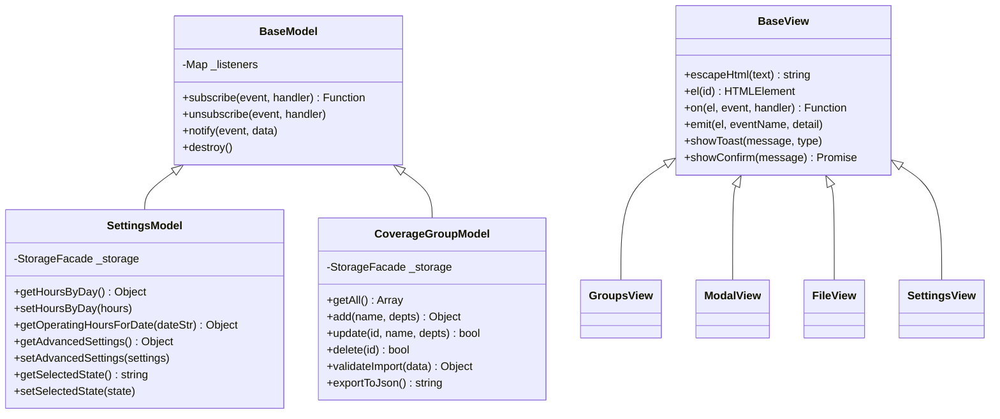
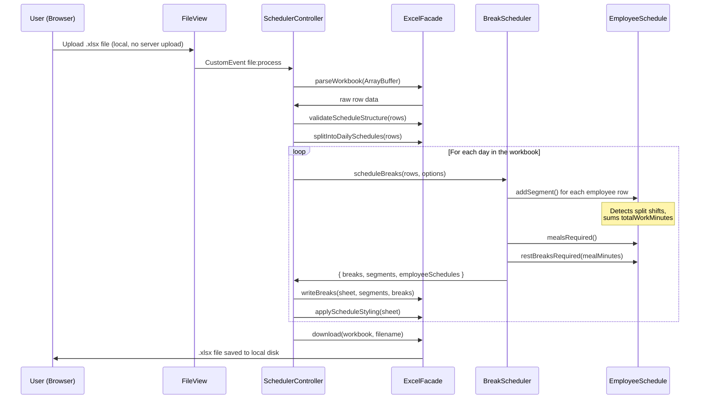
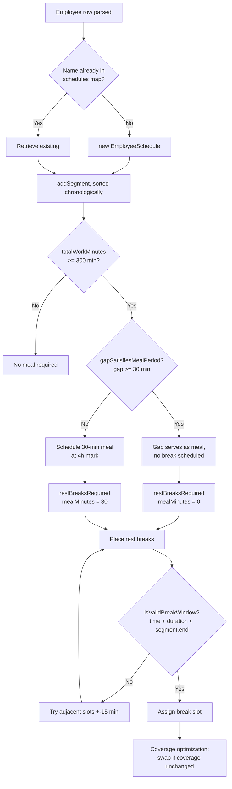
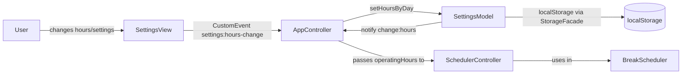

# Break Schedule Tool

I built this tool while working in retail to streamline a time-consuming daily task. Administrators and managers would spend 15-30 minutes each day manually determining breaks from a daily schedule spreadsheet, and it wasn't uncommon for there to be issus with compliance with state labor law. This tool takes the exported daily schedule from the UKG Retail Schedule Planner, calculates legally compliant meal periods and rest breaks for every employee (including split shifts), and writes them back into the spreadsheet.

I originally wrote it as a quick macro for Excel. It evolved into a basic web app, and as it has grown, I have recently refactored it to incorporate MVC, Facade, and Observer patterns, with 112 unit tests, a Vite build pipeline, and automated deployment through GitHub Actions. The software had rapidly inflated and I need to encapsulate functionality to reduce bugs when adding features or changing functionality.

**Live Demo:** [kadencampb.github.io/break-schedule-tool](https://kadencampb.github.io/break-schedule-tool)

---

## What it does

1. Upload the custom daily schedule `.xlsx` file from UKG.
2. The app parses every shift, groups employees who appear in two rows (split shifts), and calculates the correct number of meals and rest breaks under CA law
3. Break times are optimized so coworkers in the same department aren't on break at the same time
4. The completed schedule downloads as a formatted `.xlsx` file

All processing happens in the browser. Nothing is uploaded anywhere.

---

## a. Architecture and Design

### Design Patterns

| Pattern | Where Applied | Purpose |
|---|---|---|
| **MVC** | `models/` + `controllers/` + `views/` | Keeps scheduling logic out of the UI so it can be tested without a browser |
| **Facade** | `StorageFacade`, `ExcelFacade` | Wraps `localStorage` and `xlsx.js` behind clean interfaces so the rest of the app doesn't care about the details |
| **Inheritance** | `BaseModel` -> `SettingsModel`, `CoverageGroupModel` | Shared Observer behavior in one place |
| **Inheritance** | `BaseView` -> all concrete views | Shared DOM helpers (`escapeHtml`, `on`, `emit`, `showToast`) in one place |
| **Observer** | `BaseModel.subscribe` / `notify` | Controllers subscribe to model events so views re-render on data changes without direct coupling |

### MVC Layer Diagram


### Class Inheritance Diagram



### Project Structure

```
src/
├── core/                      # Pure logic, no DOM, fully unit-testable
│   ├── constants.js           # Department registry, default groups, CA law thresholds
│   ├── helpers.js             # timeToMinutes, minutesToTime, formatName, findGroupContaining
│   ├── EmployeeSchedule.js    # Per-employee segments, split shift aware
│   ├── coverage.js            # calculateCoverageMap, getCoworkersAtTime
│   ├── optimizer.js           # findOptimalBreakTime, scores candidates by coverage impact
│   └── BreakScheduler.js      # Main scheduling algorithm
├── facades/
│   ├── StorageFacade.js       # localStorage with namespaced keys and safe JSON handling
│   └── ExcelFacade.js         # xlsx.js: parse, validate, style, write breaks, download
├── models/
│   ├── BaseModel.js           # Observer/EventEmitter base class
│   ├── SettingsModel.js       # Operating hours, advanced settings, state selection
│   └── CoverageGroupModel.js  # Group CRUD, import/export, validation
├── views/
│   ├── BaseView.js            # Shared DOM helpers
│   ├── GroupsView.js          # Groups list rendering
│   ├── ModalView.js           # Add/edit group modal
│   ├── FileView.js            # File upload and download UI
│   └── SettingsView.js        # Operating hours and advanced settings UI
├── controllers/
│   ├── AppController.js       # Composition root, wires all components at startup
│   ├── GroupController.js     # Coordinates CoverageGroupModel, GroupsView, and ModalView
│   └── SchedulerController.js # Orchestrates file -> parse -> schedule -> download
└── main.js                    # Entry point

tests/
├── core/
│   ├── helpers.test.js
│   ├── EmployeeSchedule.test.js   # Split shift edge cases, CA law thresholds
│   └── BreakScheduler.test.js     # CA law compliance, break placement validity
├── models/
│   └── SettingsModel.test.js      # Observer pattern, operating hours date resolution
└── fixtures/
    └── scheduleData.js            # Synthetic test data, no real employee names or PII
```

---

## b. Data Flow Diagrams

### File Processing Pipeline



### Split Shift Break Decision Flow



### Settings and State Data Flow



---

## c. Network Diagram

This app runs entirely in the browser. No employee data is sent to any server at any point.


**Runtime:** The browser loads the app from GitHub Pages over HTTPS once. After that, everything runs locally. The Content Security Policy (`connect-src 'none'`) blocks any outbound network requests at the browser level.

**Build-time:** GitHub Actions pulls npm packages from the registry during CI. Nothing is fetched at runtime.

**CDE scope:** This app handles shift schedules only. It does not process, transmit, store, or display payment card data and is out of scope for PCI DSS / CDE requirements.

---

## d. Secure Configuration, Installation, and Operation

### Prerequisites

- Node.js v20 LTS or later
- npm v9+ (included with Node.js)
- Chrome, Edge, or Firefox

### Installation

```bash
git clone https://github.com/kadencampb/break-schedule-tool.git
cd break-schedule-tool
npm install
```

Dependencies are pinned in `package-lock.json`. Use `npm ci` instead of `npm install` in automated environments to enforce exact versions.

### Development

```bash
npm run dev         # Vite dev server at http://localhost:5173
npm test            # Run all unit tests
npm run test:watch  # Watch mode
npm run lint        # ESLint with eslint-plugin-security
npm run build       # Production build to dist/
```

### Production Deployment

The CI/CD pipeline in [.github/workflows/static.yml](.github/workflows/static.yml) runs this sequence on every push to `main`:

```
npm ci -> npm test -> npm run lint -> npm run build -> deploy dist/
```

A failed test, lint error, or build error blocks deployment. Only the compiled `dist/` directory is deployed. Source files, tests, and `node_modules` never reach the hosting environment.

### Operational Notes

- The app requires HTTPS. GitHub Pages enforces this automatically.
- The CSP is baked in at build time and cannot be changed without a source code update and a new CI/CD run.
- `localStorage` stores settings only (operating hours, coverage groups). No employee names, shift data, or PII are persisted.
- Uploaded schedule files are processed in memory and discarded when the page is closed or a new file is loaded.

---

## e. Functions, Ports, Protocols, and Services

### Runtime (Browser)

| Item | Value | Notes |
|---|---|---|
| Protocol | HTTPS | TLS 1.2+, enforced by GitHub Pages |
| Port | 443 | Standard HTTPS, no custom ports |
| Outbound connections | None | CSP `connect-src 'none'` blocks all fetch/XHR at runtime |
| File I/O | Browser File API | Local read only, no server upload |
| Persistent storage | `localStorage` | Settings only, namespaced under `breakSchedule:` prefix |
| Cookies | None | Not used |
| Service workers | None | Not used |
| WebSockets | None | Not used |
| Third-party scripts | None | All assets bundled via npm, no CDN calls at runtime |

### Build-time (CI/CD)

| Item | Value | Notes |
|---|---|---|
| Protocol | HTTPS | GitHub Actions to npm registry and GitHub Pages |
| Port | 443 | Standard HTTPS |
| npm registry | registry.npmjs.org | `npm ci` only, locked to `package-lock.json` |
| GitHub Actions runner | ubuntu-latest | Ephemeral, GitHub-managed |

### Development Server

| Item | Value | Notes |
|---|---|---|
| Protocol | HTTP | Local only, `localhost:5173` |
| Port | 5173 | Vite default, not exposed externally |

### Disabled Functions

| Item | Status | Reason |
|---|---|---|
| `eval()` / `new Function()` | Not used | Flagged by `eslint-plugin-security` |
| `innerHTML` with unsanitized input | Not used | All dynamic content goes through `BaseView.escapeHtml()` |
| CDN script loading | Blocked by CSP | `script-src 'self'` blocks external script sources |
| Inline `<script>` tags | Blocked by CSP | `script-src 'self'` with no `'unsafe-inline'` |
| HTTP (non-TLS) | Not applicable | GitHub Pages redirects HTTP to HTTPS |

---

## f. Administrative and Privileged Functions

There are no user accounts, authentication, or server-side components. The following are configuration functions available to anyone with access to the running app.

| Function | Access | Description |
|---|---|---|
| **Coverage group management** | Any user | Add, edit, delete, import, export, or reset department coverage groups |
| **Operating hours** | Any user | Set per-day store open/close times used to constrain break placement |
| **Advanced scheduling settings** | Any user | Tune `maxEarly`, `maxDelay`, `deptWeightMultiplier`, `proximityWeight` |
| **State selection** | Any user | Switch labor law jurisdiction (California only for now) |
| **Source code changes** | Repository contributors | Require a passing CI/CD pipeline before deployment |
| **Deployment** | GitHub Actions (automated) | Triggered on push to `main`, requires passing tests and lint |
| **Repository settings** | Repository owner | Branch protection, secrets, Actions permissions via GitHub |

If adopted organization-wide, coverage group defaults and operating hours should be pre-configured by a designated admin and distributed via the JSON import/export feature. Store-level users should not need to touch advanced settings.

---

## g. Security and Privacy Functions

### Content Security Policy

Applied via `<meta http-equiv="Content-Security-Policy">` at build time:

```
default-src 'self';
style-src 'self' 'unsafe-inline';
font-src 'self' data:;
img-src 'self' data:;
script-src 'self';
connect-src 'none';
```

`connect-src 'none'` is the most important directive. It prevents the page from making any network request after the initial load, regardless of what JavaScript runs. `'unsafe-inline'` for styles is required by Bootstrap 4's component animations. Script execution is restricted to `'self'` only.

### Input Validation

`ExcelFacade.validateScheduleStructure()` checks for required column headers before any data enters the scheduling pipeline. Malformed or unexpected files are rejected with a user-facing error.

### XSS Prevention

All dynamic content derived from file input goes through `BaseView.escapeHtml()` before being written to the DOM. The core scheduling pipeline has no DOM access.

### Dependency Security

- All runtime dependencies are bundled at build time. Nothing is fetched at runtime.
- `package-lock.json` locks all transitive dependency versions.
- `eslint-plugin-security` runs on every CI build and flags patterns like `eval()`, unsafe regex, and unvalidated dynamic access.
- Run `npm audit` periodically and after any dependency update. Use `npm audit fix` for auto-resolvable issues and review manually for breaking changes.

### Privacy

- No employee names, shift data, or PII are stored in `localStorage` or sent anywhere.
- Schedule files exist only in browser memory during processing and are gone when the page closes or a new file is loaded.
- Test fixtures in `tests/fixtures/scheduleData.js` use entirely synthetic names.

### Maintenance Schedule

| Task | Frequency | How |
|---|---|---|
| `npm audit` | Monthly or after any dependency update | `npm audit` / `npm audit fix` |
| Dependency updates | Quarterly | `npm outdated`, test, commit updated `package-lock.json` |
| ESLint rule review | With major ESLint or plugin releases | Review `eslint.config.js` against updated rule sets |
| CSP review | When adding new features | Verify no new external origins or inline scripts are needed |

---

## h. Roles and Responsibilities

| Role | Current Assignment | Responsibilities |
|---|---|---|
| **Developer / Owner** | Kaden Campbell | Feature development, bug fixes, dependency updates, CI/CD |
| **Security reviewer** | Unassigned | Periodic `npm audit` review, CSP review, security-sensitive code review |
| **IT / Cybersecurity partner** | Unassigned (pending org adoption) | Compliance review, approval for internal distribution |

This tool is currently maintained outside corporate IT infrastructure. Enterprise adoption would require an IT/cybersecurity contact, a formal vulnerability disclosure process, and onboarding to corporate version control per the Secure Software Development Standard.

---

## i. Significant Changes and Remediation

### v2.1 — CA DLSE compliance overhaul (current)

Updated core scheduling logic to match the strict California DLSE rest break formula and corrected break placement for shifts that include a mid-shift meal gap.

**Rest break count formula replaced.** The previous implementation used ad-hoc thresholds (>= 300 min = 2 breaks, etc.) that did not match the DLSE rule. The correct formula is one break per 4-hour work period or major fraction thereof, where "major fraction" means strictly more than 2 hours:

```js
// Before (incorrect)
if (hoursWorked >= 300) return 2;

// After (strict DLSE)
restBreaksRequired() {
    const total = this.totalWorkMinutes;
    if (total < 210) return 0;
    return Math.floor(total / 240) + (total % 240 > 120 ? 1 : 0);
}
```

A 6-hour shift now correctly gets 1 rest break (not 2). A 6h+1min shift gets 2. An 11-hour shift gets 3. The `scheduledMealMinutes` parameter was removed — rest breaks are paid time and the count does not deduct for meals.

**Break placement corrected for mid-shift meal gaps.** The previous code placed rest breaks at fixed wall-clock offsets from shift start (`overallStart + 120`). This produced wrong times when the shift had a meal period gap, because the offset treated the gap as worked time.

New method `workedTimeToClockTime(targetWorkedMin)` walks the employee's segments and skips unpaid gaps. Break n is placed at the 2-hour midpoint of the nth 4-hour worked period in net worked time:

```js
// Employee 10AM-2:45PM + 3:15PM-6:30PM (30-min meal gap)
// Break 2 ideal: 360 net worked min
// After 285 min (end of seg 1), need 75 more → 3:15PM + 75 min = 4:30PM ✓
```

18 new unit tests added (112 total), covering the 6h boundary, `workedTimeToClockTime` for single and multi-segment shifts, and end-to-end break placement assertions for the meal-gap scenario.

---

### v2.0

Full architectural rebuild. The original codebase was ~2,500 lines split across two files with no tests, no build step, and several logic bugs that produced incorrect break schedules.

#### Structural Changes

| Area | v1.x | v2.0 |
|---|---|---|
| Architecture | 2,500 lines across 2 files | MVC: `models/`, `views/`, `controllers/`, `core/` |
| Dependencies | CDN-loaded Bootstrap, Font Awesome, xlsx | npm packages bundled by Vite, no runtime CDN calls |
| Build pipeline | None, raw files served directly | Vite with tree-shaking, chunking, and `dist/`-only deployment |
| Testing | None | 112 Vitest unit tests |
| Static analysis | None | ESLint + `eslint-plugin-security` |
| CI/CD | Deploy on push with no gates | Test -> lint -> build -> deploy (any failure blocks deployment) |
| Security | No CSP, CDN scripts, global namespace | CSP meta tag, `connect-src 'none'`, ES modules |

#### Bug Remediation

**Bug 1 - Split shift duration miscalculation (CA labor law compliance)**

*Symptom:* An employee working 7AM-11AM and 3PM-7PM (8 hours of actual work) was treated as working a 12-hour span. This caused the scheduler to assign an extra meal period and extra rest breaks.

*Root cause:* `shifts[name] = [Math.min(...starts), Math.max(...ends)]` used span instead of sum.

*Fix:* `EmployeeSchedule.totalWorkMinutes` sums actual segment durations.
```js
get totalWorkMinutes() {
    return this.segments.reduce((sum, s) => sum + (s.end - s.start), 0);
}
```

---

**Bug 2 - Break slot index collision (data integrity)**

*Symptom:* For employees needing both a second rest break and a second meal period, one silently overwrote the other in the output spreadsheet.

*Root cause:* Breaks were stored as a positional array. `breaks[name][2]` was used for both the second rest break and the second meal period.

*Fix:* Named break structure.
```js
breaks[name] = { rest1: null, meal: null, rest2: null, rest3: null };
```

---

**Bug 3 - Break placed inside unpaid gap (CA labor law compliance)**

*Symptom:* Rest breaks were occasionally scheduled during the unpaid gap between a split shift's two segments.

*Root cause:* The validity check used `shiftStart` and `shiftEnd` from the overall span rather than individual segment boundaries.

*Fix:* `isValidBreakWindow(time, duration)` requires the entire break to fall within a single segment.
```js
isValidBreakWindow(time, duration) {
    return this.segments.some(s => time >= s.start && (time + duration) < s.end);
}
```

---

**Bug 4 - DOM-coupled scheduling logic (testability)**

*Symptom:* `getOperatingHoursForDate()` read directly from `<input>` DOM elements, making it untestable and fragile if called before the DOM was ready.

*Fix:* Logic moved to `SettingsModel.getOperatingHoursForDate(dateString)`, which reads from in-memory model state. No DOM access in the scheduling pipeline.

---

**Bug 5 - Duplicate function with incompatible signatures (reliability)**

*Symptom:* `findGroupContaining` existed in two places with different parameter signatures, producing inconsistent results depending on which version was in scope.

*Fix:* Single canonical implementation in `src/core/helpers.js` with an explicit `groups` parameter at all call sites.

---

## California Labor Law Reference

### Meal periods

| Total hours worked | Meal periods required |
|---|---|
| < 5h (< 300 min) | 0 |
| >= 5h (>= 300 min) | 1 |
| >= 10h (>= 600 min) | 2 |
| Split shift — gap >= 30 min | Gap satisfies first meal; same totals apply |

### Rest breaks

One paid 10-minute rest break per 4-hour work period or **major fraction thereof** (CA DLSE: strictly more than 2 hours). No break if total shift is under 3.5 hours.

Formula: `floor(totalMinutes / 240) + (totalMinutes % 240 > 120 ? 1 : 0)`

| Total shift minutes | Breaks |
|---|---|
| < 210 (< 3.5h) | 0 |
| 210-360 (3.5h to 6h) | 1 |
| 361-480 (6h+1min to 8h) | 2 |
| 481-600 (8h+1min to 10h) | 2 |
| 601-720 (10h+1min to 12h) | 3 |

Note: a 6-hour shift gets **1** rest break (remainder = 120 min, which is NOT strictly greater than 120). A 6h+1min shift gets 2. Rest breaks are paid and count as worked time; no deduction is applied when calculating the count.

Break placement uses net worked time, not wall-clock offsets. Each break is placed at the 2-hour mark of its 4-hour worked period, which correctly accounts for meal gaps mid-shift.

---

## Tech Stack

| Tool | Version | Purpose |
|---|---|---|
| **Vite** | ^5.0 | Build tool, dev server, ESM bundling |
| **Vitest** | ^1.0 | Unit testing, ESM-native, shares Vite config |
| **ESLint** | ^9.0 | Static analysis |
| **eslint-plugin-security** | ^3.0 | Security-specific lint rules |
| **Bootstrap** | ^4.6.2 | UI components via npm, no CDN |
| **Font Awesome** | ^6.5.0 | Icons via npm, no CDN |
| **xlsx (SheetJS)** | ^0.18.5 | Excel file parsing and generation |
| **@rollup/plugin-inject** | ^5.0 | Provides jQuery global for Bootstrap 4 in ESM context |
| **GitHub Actions** | - | CI/CD: test -> lint -> build -> deploy |
| **GitHub Pages** | - | Static hosting over HTTPS |

---

## License

MIT
